# Interactive Technical Documentation — Queens Attack Board (Flutter)

<a id="top"></a>

> Generated from a single supplied Dart source file (referred to below as `main.dart`). No `pubspec.yaml`, additional source files, or app name were provided — see [Overview & Assumptions](#overview) for every assumption made while building this document.

---

## Table of Contents

- [Overview & Assumptions](#overview)
- [1. Function Flowcharts](#sec-flowcharts)
  - [1.1 `Cell._decodeState()`](#fn-decodestate)
  - [1.2 `Cell.build()`](#fn-cell-build)
  - [1.3 `_CanvasState.initState()`](#fn-initstate)
  - [1.4 `_CanvasState._initCanvas()`](#fn-initcanvas)
  - [1.5 `_CanvasState._recomputeAttacks()`](#fn-recomputeattacks)
  - [1.6 `_CanvasState._markAttacksFrom()`](#fn-markattacksfrom)
  - [1.7 `_CanvasState._onCellTapped()`](#fn-oncelltapped)
  - [1.8 `_CanvasState.build()`](#fn-canvasstate-build)
  - [Trivial functions (excluded)](#fn-trivial)
- [2. State Diagrams](#sec-state-diagrams)
  - [2.1 `_CanvasState` — widget lifecycle](#state-canvasstate)
  - [2.2 `CellData.stateString` — per-cell state machine](#state-celldata)
- [3. Class Inheritance Diagram](#sec-class-diagram)
- [4. Widget Tree](#sec-widget-tree)
- [5. Call Graph](#sec-call-graph)
- [6. Dependency Graph (Files/Modules)](#sec-dependency-graph)
- [7. Navigation Graph](#sec-navigation-graph)
- [8. Custom Widgets Inventory](#sec-widget-inventory)
- [9. State Variables Inventory](#sec-state-var-inventory)
- [10. Data Flow Summary](#sec-data-flow)
- [11. External Packages](#sec-external-packages)

---

<a id="overview"></a>
## Overview & Assumptions

This is a small single-screen Flutter app that renders an *N×N* grid (instantiated with `N = 8`). Tapping a cell toggles it between "queen" and "not queen"; whenever the queen set changes, every cell that shares a row, column, or diagonal with **any** queen is highlighted as "attacked."

**Classes defined in the source:** `MainApp`, `CellData`, `Cell`, `Canvas`, `_CanvasState` (the private `State` class for `Canvas`), plus the top-level `main()` function.

**Explicit assumptions (state per instructions, not guessed):**
- Only one Dart file was supplied, so it is treated as the entire project (referred to as `main.dart`). No `pubspec.yaml` was given, so the app/package name is unknown and not invented.
- There is no navigation code (`Navigator`, named routes, `onGenerateRoute`) anywhere in the source, so [Section 7](#sec-navigation-graph) documents a single static screen.
- Flutter framework classes shown in the [Class Diagram](#sec-class-diagram) (`Widget`, `StatelessWidget`, `StatefulWidget`, `State<T>`, `Diagnosticable`) are **not** defined in this file — they are included as external context from the Flutter SDK, based on well-known SDK structure, and are labeled as such.
- **Naming note:** the user-defined `Canvas` class shadows `dart:ui`'s built-in `Canvas` (the 2D-drawing class used by `CustomPainter`), which is re-exported transitively through `package:flutter/material.dart`. This is a naming collision worth knowing about if this code is extended to use custom painting.
- Diagram legend: mermaid `click id href "#anchor"` directives are included for interactivity; because not every Markdown renderer executes Mermaid click handlers, a plain-text link is also given under every diagram as a reliable fallback.

**Flowchart shape legend** (applies to all diagrams in [Section 1](#sec-flowcharts) and [Section 5](#sec-call-graph)):

| Shape | Meaning |
|---|---|
| `([Start/End])` stadium | Function entry or return point |
| `{Decision}` diamond | Conditional branch (`if`, `switch`, loop test) |
| `[Process]` rectangle | An action / assignment |
| `[[Call]]` subroutine | A call to another documented function (cross-linked) |

[⬆ Back to top](#top)

---

<a id="sec-flowcharts"></a>
## 1. Function Flowcharts

<a id="fn-decodestate"></a>
### 1.1 `Cell._decodeState(String state) → Color`

Maps a cell's logical state (`'D'`/`'Q'`/`'A'`) to the fill color used in `build()`. Pure function, no side effects.

**Calls:** none · **Called by:** [`Cell.build()`](#fn-cell-build)

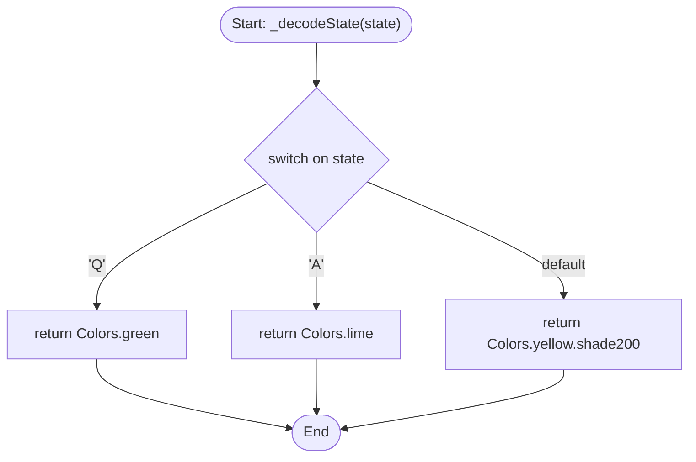
→ See also: [`Cell.build()`](#fn-cell-build) · [Cell state machine](#state-celldata)

---

<a id="fn-cell-build"></a>
### 1.2 `Cell.build(BuildContext context) → Widget`

Builds a single grid square: computes its color via `_decodeState`, then wraps a colored/bordered `Container` in a `GestureDetector` so taps are forwarded to the `onTap` callback supplied by the parent (`_CanvasState.build()`).

**Calls:** [`_decodeState()`](#fn-decodestate) · **Called by:** framework, once per `Cell` instance inside [`_CanvasState.build()`](#fn-canvasstate-build)

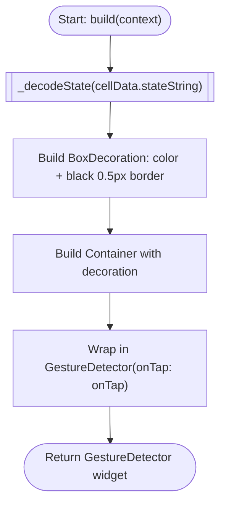
→ See also: [`_decodeState()`](#fn-decodestate). The `onTap` closure itself is created in [`_CanvasState.build()`](#fn-canvasstate-build) and, when fired at runtime, calls [`_onCellTapped()`](#fn-oncelltapped) — see the [Data Flow Summary](#sec-data-flow) for the full runtime chain.

---

<a id="fn-initstate"></a>
### 1.3 `_CanvasState.initState() → void`

Standard Flutter lifecycle hook; populates the initial grid.

**Calls:** `super.initState()` (framework), [`_initCanvas()`](#fn-initcanvas) · **Called by:** Flutter framework, exactly once when `_CanvasState` is first mounted

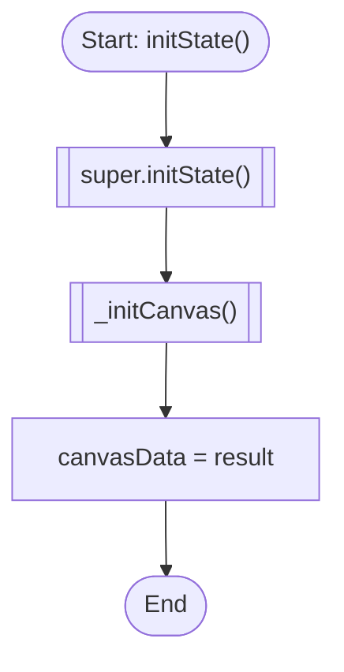
→ See also: [`_initCanvas()`](#fn-initcanvas) · [`_CanvasState` lifecycle diagram](#state-canvasstate)

---

<a id="fn-initcanvas"></a>
### 1.4 `_CanvasState._initCanvas() → List<List<CellData>>`

Builds the initial `canvasSize × canvasSize` grid of `CellData`, all starting in the `'D'` (default) state. Implemented in the source as nested `List.generate` calls; shown below as an equivalent nested loop.

**Calls:** `CellData(row, col, 'D')` constructor · **Called by:** [`initState()`](#fn-initstate)

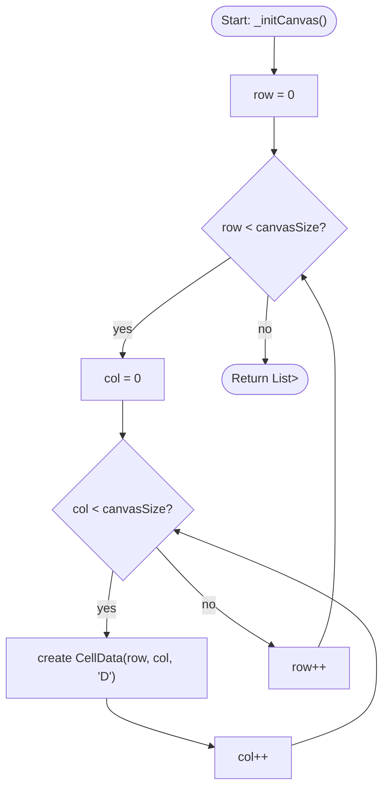
→ See also: [`initState()`](#fn-initstate) · [State variables inventory](#sec-state-var-inventory)

---

<a id="fn-recomputeattacks"></a>
### 1.5 `_CanvasState._recomputeAttacks() → void`

Two-phase pass over the whole grid: **(1)** reset every non-queen cell back to `'D'`, then **(2)** for every remaining `'Q'` cell, mark its attack lines by delegating to `_markAttacksFrom`.

**Calls:** [`_markAttacksFrom()`](#fn-markattacksfrom), once per queen found · **Called by:** [`_onCellTapped()`](#fn-oncelltapped) (always inside its `setState` callback)

<details>
<summary>Show flowchart (large — click to expand)</summary>

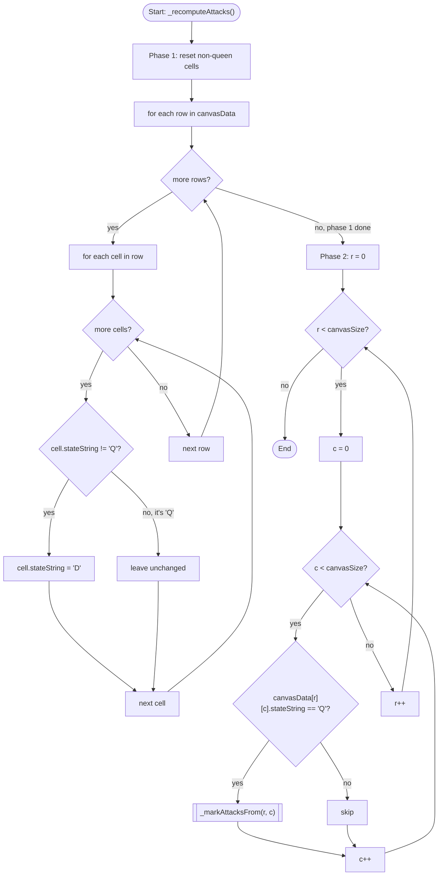

</details>

→ See also: [`_markAttacksFrom()`](#fn-markattacksfrom) · [`_onCellTapped()`](#fn-oncelltapped) · [Cell state machine](#state-celldata) (this function is what drives the `D ⇄ A` transitions)

---

<a id="fn-markattacksfrom"></a>
### 1.6 `_CanvasState._markAttacksFrom(int epicenterRow, int epicenterCol) → void`

The most complex function in the file. Given one queen's position, it marks every `'D'` cell that shares its row, column, or either diagonal as `'A'` (attacked). The four diagonal directions (↘ ↙ ↗ ↖) are each checked **independently** on every iteration of `i` — they are not an if/else-if chain.

**Calls:** none (pure grid mutation) · **Called by:** [`_recomputeAttacks()`](#fn-recomputeattacks), once per queen on the board

<details>
<summary>Show flowchart (large — click to expand)</summary>

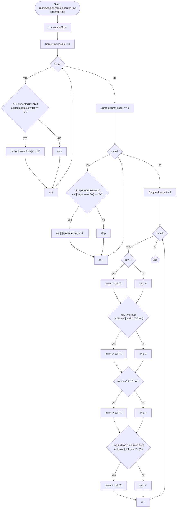

</details>

→ See also: [`_recomputeAttacks()`](#fn-recomputeattacks) · [Cell state machine](#state-celldata)

---

<a id="fn-oncelltapped"></a>
### 1.7 `_CanvasState._onCellTapped(int row, int col) → void`

The sole event handler in the app and the **only `setState()` call site**. Toggles the tapped cell between `'Q'` and "not `'Q'`", then immediately recomputes all attack lines — both inside the same `setState` callback, so Flutter performs exactly one rebuild per tap.

**Calls:** `setState()` (framework), [`_recomputeAttacks()`](#fn-recomputeattacks) · **Called by:** the `onTap` closure built in [`_CanvasState.build()`](#fn-canvasstate-build), fired by `GestureDetector` inside [`Cell.build()`](#fn-cell-build)

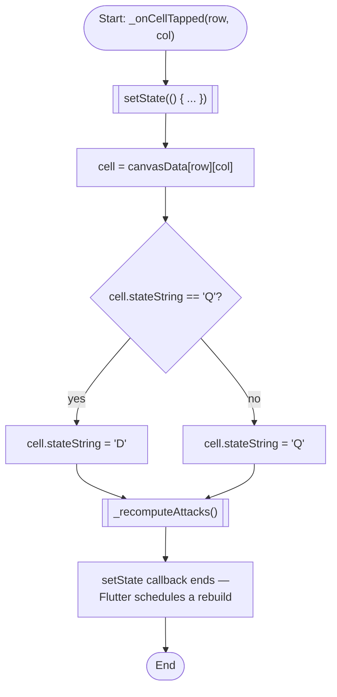
→ See also: [`_recomputeAttacks()`](#fn-recomputeattacks) · [`_CanvasState` lifecycle](#state-canvasstate) · [Data Flow Summary](#sec-data-flow)

---

<a id="fn-canvasstate-build"></a>
### 1.8 `_CanvasState.build(BuildContext context) → Widget`

Renders the grid: an outer loop builds one `Expanded(Row(...))` per row, an inner loop builds one `Expanded(Cell(...))` per column. Each `Cell` is given a closure that calls `_onCellTapped` with that cell's fixed `(row, col)`.

**Calls:** [`_onCellTapped()`](#fn-oncelltapped) (indirectly, via the closure bound to each `Cell`) · **Called by:** Flutter framework, initially and after every `setState()`

<details>
<summary>Show flowchart (large — click to expand)</summary>

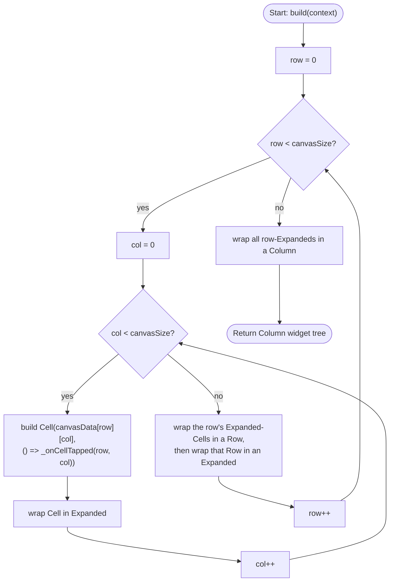

</details>

→ See also: [`_onCellTapped()`](#fn-oncelltapped) · [`Cell.build()`](#fn-cell-build) · [Widget Tree](#sec-widget-tree)

---

<a id="fn-trivial"></a>
### Trivial functions (excluded from flowcharts)

Per the "non-trivial" scope, these two are omitted here since they contain no branches or loops — they are fully represented in the [Call Graph](#sec-call-graph) and [Widget Tree](#sec-widget-tree) instead:

- **`main()`** — one line: `runApp(const MainApp());`
- **`MainApp.build()`** — a single straight-line widget composition (`MaterialApp` → `Scaffold` → `Center` → `Padding` → `AspectRatio` → `Canvas(8)`), no conditionals.

[⬆ Back to top](#top)

---

<a id="sec-state-diagrams"></a>
## 2. State Diagrams

Only one class in the file is a `StatefulWidget`/`State` pair: `Canvas` / `_CanvasState`. Its widget-level lifecycle is diagram 2.1. Since the app's actual interesting behavior lives in each cell's `stateString`, diagram 2.2 documents that derived state machine as a bonus.

<a id="state-canvasstate"></a>
### 2.1 `_CanvasState` — widget lifecycle & interaction states

```mermaid
stateDiagram-v2
    [*] --> Created : Canvas(canvasSize: 8) constructed\ninside MainApp.build()

    Created --> StateCreated : Flutter calls Canvas.createState()\n-> new _CanvasState()

    StateCreated --> Initialized : initState() runs\ncanvasData = _initCanvas()\n(64 CellData objects, all 'D')

    Initialized --> Rendered : build() runs\nColumn/Row/Expanded/Cell tree emitted

    Rendered --> Rendered : User taps a Cell\n_onCellTapped(row, col) fires\nsetState( toggle Q/D; _recomputeAttacks() )\nFlutter re-invokes build()

    Rendered --> [*] : Widget removed from tree\n(dispose() not overridden - default no-op)

    note right of Initialized
        Lifecycle methods present: initState()
        Lifecycle methods NOT implemented:
        didChangeDependencies, didUpdateWidget, dispose
        OBSERVATION: framework defaults apply for these;
        they are never meaningfully exercised because
        Canvas is created once with a constant
        canvasSize and is never rebuilt by an ancestor
        with different constructor parameters.
        No Navigator / route transitions occur anywhere
        in this widget's lifetime (single-screen app).
    end note
```
→ See also: [`initState()`](#fn-initstate) · [`_onCellTapped()`](#fn-oncelltapped) · [`build()`](#fn-canvasstate-build) · [State variables inventory](#sec-state-var-inventory)

---

<a id="state-celldata"></a>
### 2.2 `CellData.stateString` — per-cell state machine

`CellData` itself isn't a widget, but its mutable `stateString` field ('D' / 'Q' / 'A') is the actual unit of UI state that `Cell` renders. Because the tap-toggle and the attack-recompute both run **inside the same `setState` callback** (see [`_onCellTapped()`](#fn-oncelltapped)), intermediate states are never rendered — only the settled state after both steps is shown to the user.

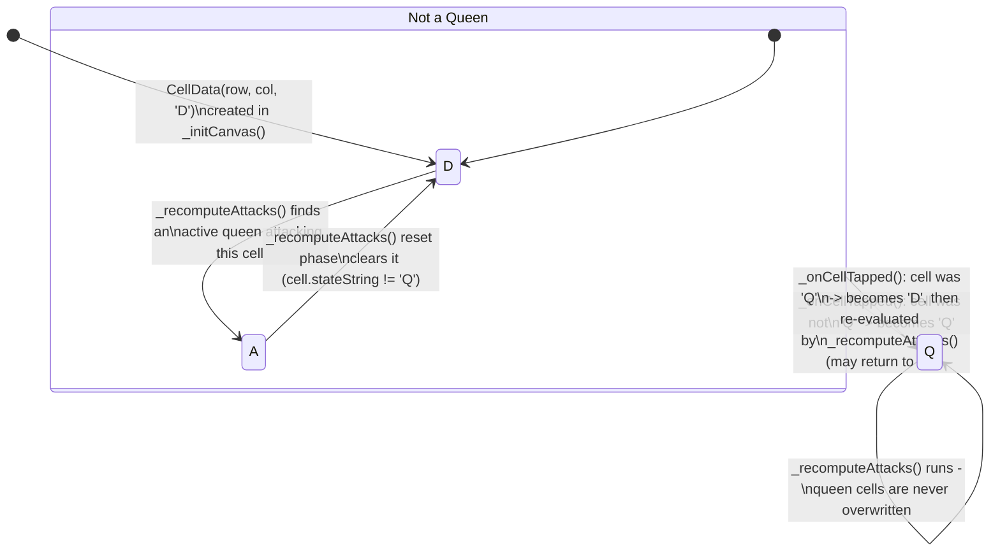
→ See also: [`_markAttacksFrom()`](#fn-markattacksfrom) · [`_recomputeAttacks()`](#fn-recomputeattacks) · [`Cell._decodeState()`](#fn-decodestate) (renders each of these three states as a color)

[⬆ Back to top](#top)

---

<a id="sec-class-diagram"></a>
## 3. Class Inheritance Diagram

Classes defined in the source are shown with full members; Flutter SDK classes are shown as external context (see [Assumptions](#overview)) so the inheritance chain is complete. `State<T>` is generic — instantiated here as `State<Canvas>`.

<details>
<summary>Show class diagram</summary>

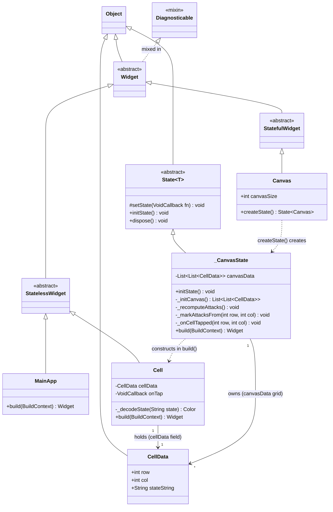

</details>

**Notes:**
- `VoidCallback` (the type of `Cell.onTap`) is a `dart:ui` function-type alias, not a class, so it's not shown as a node.
- `Diagnosticable`/mixin relationship is a simplification of Flutter's actual internal hierarchy (`Widget` really extends `DiagnosticableTree`), included for context only — this detail is external SDK knowledge, not something inferred from the supplied file.
- Only five classes are actually defined in the source: `MainApp`, `Cell`, `Canvas`, `_CanvasState`, `CellData`.

→ See also: [Widget Tree](#sec-widget-tree) · [Custom Widgets Inventory](#sec-widget-inventory)

[⬆ Back to top](#top)

---

<a id="sec-widget-tree"></a>
## 4. Widget Tree

There is exactly one screen — `MaterialApp`'s default `home:` — since no routes are defined ([see Navigation Graph](#sec-navigation-graph)). The 8×8 grid is collapsed below to `×8`/`×64` annotations rather than drawn 64 times.

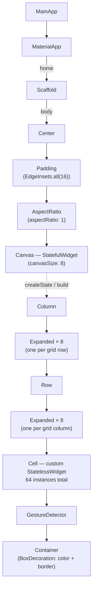
→ See also: [`_CanvasState.build()` flowchart](#fn-canvasstate-build) · [`Cell.build()` flowchart](#fn-cell-build) · [Class Diagram](#sec-class-diagram)

**Implementation note:** `Center → Padding → AspectRatio → Canvas(8)` is a single `const` subtree in the source (`Canvas` and `Cell` both have `const` constructors), which is a minor build-time performance optimization worth preserving in any refactor.

[⬆ Back to top](#top)

---

<a id="sec-call-graph"></a>
## 5. Call Graph

Solid arrows are direct calls from application code; dashed arrows are framework-mediated calls (Flutter invoking a lifecycle/build method, or a user gesture firing a bound callback at runtime).

<details>
<summary>Show call graph</summary>

```mermaid
flowchart LR
    main(["main()"]) --> runApp["runApp() (framework)"]
    runApp -.->|instantiates & mounts| mainAppBuild["MainApp.build()"]
    mainAppBuild --> canvasCtor["Canvas(8) constructor"]
    canvasCtor -.->|framework calls| createState["Canvas.createState()"]
    createState --> canvasStateCtor["new _CanvasState()"]
    canvasStateCtor -.->|framework calls| initState["_CanvasState.initState()"]
    initState --> initCanvas["_initCanvas()"]
    canvasStateCtor -.->|framework calls| csBuild["_CanvasState.build()"]
    csBuild --> cellCtor["Cell(...) constructor ×64"]
    cellCtor -.->|framework calls| cellBuild["Cell.build()"]
    cellBuild --> decodeState["_decodeState()"]
    cellBuild --> gd["GestureDetector\n(binds onTap closure)"]
    gd -.->|user taps, runtime| onCellTapped["_onCellTapped(row, col)"]
    onCellTapped --> recompute["_recomputeAttacks()"]
    recompute --> markAttacks["_markAttacksFrom(r, c)\n(once per queen)"]
    onCellTapped -.->|setState schedules rebuild| csBuild

    click decodeState href "#fn-decodestate"
    click onCellTapped href "#fn-oncelltapped"
    click recompute href "#fn-recomputeattacks"
    click markAttacks href "#fn-markattacksfrom"
    click initCanvas href "#fn-initcanvas"
    click csBuild href "#fn-canvasstate-build"
    click cellBuild href "#fn-cell-build"
    click initState href "#fn-initstate"
```

</details>

→ See also: every function in [Section 1](#sec-flowcharts) links back here via its own flowchart's "Called by" line.

[⬆ Back to top](#top)

---

<a id="sec-dependency-graph"></a>
## 6. Dependency Graph (Files/Modules)

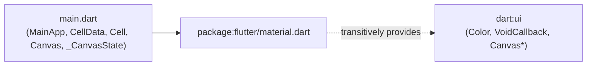

**Assumption:** exactly one source file was supplied, with no `pubspec.yaml`. This graph is therefore necessarily trivial — one file depending on the Flutter Material library (which itself pulls in `dart:ui`, the source of the `Canvas` naming collision noted in [Overview](#overview)). If the real project splits models/widgets across multiple files, that structure wasn't part of the analyzed source and isn't represented here.

[⬆ Back to top](#top)

---

<a id="sec-navigation-graph"></a>
## 7. Navigation Graph

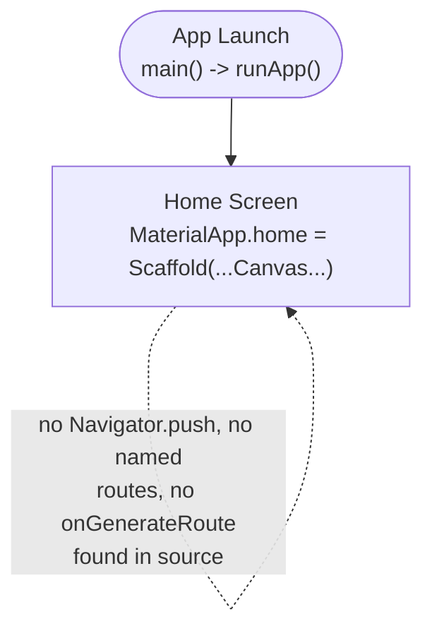

**Observation, not an inference:** the source contains no `Navigator` calls, no `routes:` table, and no `onGenerateRoute`. This is a single, static screen with no transitions — the self-loop above simply reflects that all user interaction (cell taps) stays on this one screen.

[⬆ Back to top](#top)

---

<a id="sec-widget-inventory"></a>
## 8. Custom Widgets Inventory

| Widget | Type | Used inside | Instance count |
|---|---|---|---|
| [`MainApp`](#sec-class-diagram) | `StatelessWidget` | Root — passed to `runApp()` in `main()` | 1 |
| [`Canvas`](#sec-class-diagram) | `StatefulWidget` | `MainApp.build()`, inside `AspectRatio` | 1 |
| [`Cell`](#sec-class-diagram) | `StatelessWidget` | [`_CanvasState.build()`](#fn-canvasstate-build), inside each `Expanded` | `canvasSize²` = 64 (for `canvasSize = 8`) |

`CellData` is **not** a widget — it is a plain Dart data holder (row, col, stateString) passed into `Cell` as a constructor argument. It's listed in the [Class Diagram](#sec-class-diagram) and [State Variables Inventory](#sec-state-var-inventory) instead.

[⬆ Back to top](#top)

---

<a id="sec-state-var-inventory"></a>
## 9. State Variables Inventory

| Variable | Owner | Type | Initialized | Modified by | Rebuild trigger |
|---|---|---|---|---|---|
| `canvasData` | `_CanvasState` | `List<List<CellData>>` | [`initState()`](#fn-initstate) via [`_initCanvas()`](#fn-initcanvas) | Reference itself never reassigned after `initState`; its `CellData` contents are mutated in place by [`_onCellTapped()`](#fn-oncelltapped), [`_recomputeAttacks()`](#fn-recomputeattacks), [`_markAttacksFrom()`](#fn-markattacksfrom) | `setState()` — called only inside [`_onCellTapped()`](#fn-oncelltapped) |
| `stateString` (per cell) | `CellData` | `String` (`'D'` \| `'Q'` \| `'A'`) | `'D'` in [`_initCanvas()`](#fn-initcanvas) | [`_onCellTapped()`](#fn-oncelltapped) (toggle Q/D), [`_recomputeAttacks()`](#fn-recomputeattacks) / [`_markAttacksFrom()`](#fn-markattacksfrom) (D ⇄ A) | Indirect — mutation happens inside the same `setState()` call above |

**Technical note:** this is a *mutable in-place* state pattern — `canvasData`'s list identity never changes; Flutter's rebuild is driven purely by the `setState()` call, not by reassigning `canvasData` to a new list. See the [Cell state machine](#state-celldata) for the exact transition rules on `stateString`.

[⬆ Back to top](#top)

---

<a id="sec-data-flow"></a>
## 10. Data Flow Summary — user input → UI update

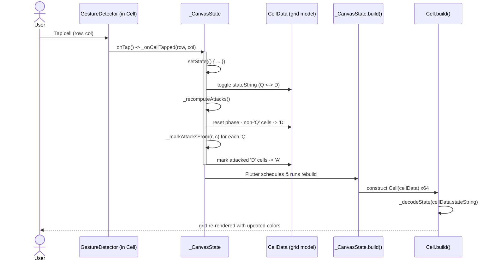

**In prose:** a tap on any grid square is caught by that square's `GestureDetector` ([`Cell.build()`](#fn-cell-build)) and forwarded to [`_onCellTapped(row, col)`](#fn-oncelltapped). Inside a single `setState()` callback, the tapped `CellData.stateString` is toggled and [`_recomputeAttacks()`](#fn-recomputeattacks) re-derives every other cell's state by resetting non-queen cells and re-scanning all queens via [`_markAttacksFrom()`](#fn-markattacksfrom). Because all mutation happens before `setState()`'s callback returns, Flutter performs exactly one rebuild: [`_CanvasState.build()`](#fn-canvasstate-build) reconstructs all 64 `Cell` widgets from the (mutated) `canvasData`, and each `Cell.build()` re-derives its color via [`_decodeState()`](#fn-decodestate) — the only place model state (`'D'`/`'Q'`/`'A'`) is translated into a visual (`Color`).

[⬆ Back to top](#top)

---

<a id="sec-external-packages"></a>
## 11. External Packages

| Import | Source | Purpose in this app |
|---|---|---|
| `package:flutter/material.dart` | Flutter SDK (not a pub.dev third-party package) | Provides `MaterialApp`, `Scaffold`, `Center`, `Padding`, `AspectRatio`, `Column`, `Row`, `Expanded`, `GestureDetector`, `Container`, `BoxDecoration`, `Border`, `Colors`, `StatelessWidget`, `StatefulWidget`, `State`, `EdgeInsets`, `BuildContext` |

No other imports are present. `VoidCallback` (used as the type of `Cell.onTap`) comes transitively from `dart:ui`, which `material.dart` re-exports — no separate import statement is needed for it. **No third-party pub.dev packages** (state management, HTTP, etc.) are used anywhere in the supplied source.

[⬆ Back to top](#top)
